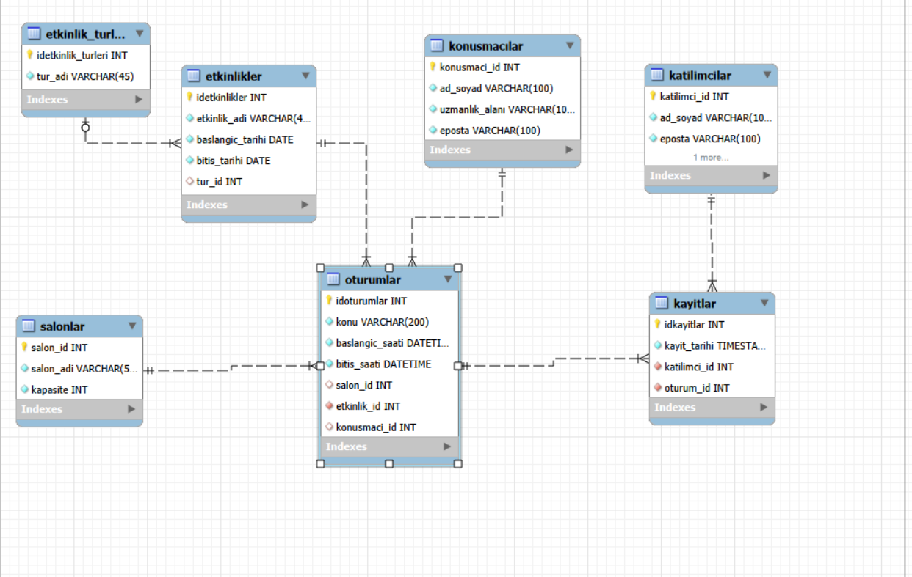

# Expo-DB-System

**Kurum:** Kocaeli Üniversitesi  
**Bölüm:** Bilişim Sistemleri Mühendisliği  
**Ders:** TBL331 Veritabanı Yönetim Sistemleri (2025-2026 Bahar)  
**Grup No:99** 241307043 Meryem Özübek-231307028 Ülkü Hatip
# Expo-DB-System

Fuar ve Konferans Organizasyon Otomasyonu Proje Raporu
Proje Ozeti
Bu proje, coklu salonlarin tahsisi, konusmaci planlamalari, etkinlik kategorizasyonu ve katilimci kayitlarinin takibini otomatize eden gelismis bir iliskisel veritabanı sistemidir.

Veri Butunlugu (Data Integrity): Sistemde olusabilecek zaman ve mekan cakismalari ile kontenjan ihlalleri gibi operasyonel riskler, uygulama katmanina birakilmadan dogrudan veritabanı motoru seviyesinde engellenmistir.

Normalizasyon Stratejisi: Veri tekrarini, ekleme, silme ve guncelleme anomalilerini onlemek adina veritabanı mimarisi ACID kurallarina bagli kalinarak ust duzey normalizasyon kurallarina uygun kurgulanmistir.

Gelismiş SQL Nesneleri: Projenin is mantigi, sorgu optimizasyonu ve performans duvarlari; triggers (tetikleyiciler), stored procedures (sakli yordamlar) ve views (gorunumler) kullanilarak yapilandirilmistir.

Gelistirme Ortami
Veritabani Yonetim Sistemi: MySQL Server 8.0 (İslem guvenligi ve Foreign Key destegi icin InnoDB motoru tercih edilmistir).

Tasarim ve Modelleme: MySQL Workbench EER Tasarim Araci.

Gelistirme Editoru: Visual Studio Code (VS Code).

Surum Kontrol Sistemi: Git & GitHub (Ekip calismasi ve branch yonetimi icin aktif kullanilmistir).

Projenin Yuklenmesi ve Calisir Hale Getirilmesi
Projenin herhangi bir MySQL sunucusunda hatasiz ve sirali sekilde calisabilmesi icin SQL betikleri asagidaki islem sirasina gore execute edilmelidir:

fuar1.sql (Sema ve Veri Yukleme): Iliskisel tablo yapilarini, birincil (idoturumlar, idetkinlikler vb.) ve yabanci anahtarlari olusturur; sistemi test verileriyle doldurur.

views.sql (Soyutlama ve Raporlama): Karmaasik sorgulari ve JOIN maliyetlerini gizleyen, raporlamayi hizlandiran sanal tablolari sisteme yukler.

indexes.sql (Performans Optimizasyonu): Arama ve look-up islemlerindeki darlbogazlari cozmek icin B-Tree algoritmali bileşik indeksleri devreye alir.

triggers.sql (Otomatik Is Kurallari): Veri girisi aninda kontenjan ve zaman cakismalarini denetleyen guvenlik tetikleyicilerini aktif eder.

procedures.sql (Otomasyon ve Yonetim): Hizli katilimci kaydi gibi cok adimli islemleri tek komutla yürüten yordamlari sisteme dahil eder.

Gelistirilen Arayuz Gorseli (EER Diyagrami)
Sistemin mantiksal modelini, veri tiplerini ve tablolar arasindaki tum ilskisel baglari gosteren veri tabani mimari şeması asagidadir:

Sistem Bilesenleri
Hocanin isterleri dogrultusunda projeye entegre edilen ve kod kalitesini artiran gelismis SQL nesnelerinin amaclari ve fonksiyonlari maddeler halinde asagida aciklanmistir:

1. Performans Indeksleri (indexes.sql)
Sistemde sorgu maliyetlerini dusurmek ve EXPLAIN analizlerinde optimum performansi yakalamak icin 8 adet ozel indeks kurgulanmistir:

idx_etkinlik_tarih_araligi: Belirli tarihler arasindaki etkinlik aramalarini optimize eder.

idx_oturum_salon_saat: Salon id, baslangic ve bitis saatlerini iceren uclu bilesik (composite) indeks yapisidir; salon bazli zaman aramalarini hizlandirir.

idx_kayit_tarihi: Son 1 aydaki kayitlar gibi zaman bazli kurumsal raporlamalarda full table scan yapilmasini engeller.

idx_etkinlik_tur: Etkinlik turune gore filtreleme ve siralama islemlerine hiz kazandirir.

idx_katilimci_eposta: Katilimci e-posta aramalarinda ve mukerrer kayit kontrollerinde hizli lookup saglar.

idx_kayit_katilimci_oturum: Katilimci id ve oturum id uzerinden kisiye ozel bilet ve kayit gecmisi sorgularini optimize eder.

idx_oturum_etkinlik ve idx_oturum_konusmaci: Oturum tablosundaki Foreign Key (Yabanci Anahtar) iliskilerini ve JOIN performanslarini yukseltir.

2. Yonetimsel Raporlar (views.sql)
Gelistiricilerin ve organizatorlerin karmaasik sorgular yazmasini onleyen ve veri maskeleme saglayan 5 adet rapor gorumumu kurgulanmistir:

vw_detayli_etkinlik_programi: Oturum, etkinlik, etkinlik turu, salon ve konusmaci verilerini tek bir yapida birlestiren kapsamli program rehberidir.

vw_oturum_doluluk_analizi: Her oturum icin salon kapasitesini, kayitli katilimci sayisini, kalan kontenjani ve yuzdesel doluluk oranini anlık hesaplar.

vw_populer_oturumlar: En cok katilimcinin kayit oldugu, yuksek ilgi goren oturumlari azalan sirada listeler.

vw_bos_oturumlar: Hic katilimcisi olmayan oturumlari tespit ederek pazarlama ve kampanya yonetimine karar destek saglar.

vw_konusmaci_basarisi: Konusmacilarin toplam oturum sayilarini, ulastiklari toplam katilimci rakamlarini ve oturum basina dusen ortalama dinleyici performanslarini analiz eder.

3. Akıllı Tetikleyiciler (triggers.sql)
trg_kayit_kapasite_kontrol: Bir oturuma ait mevcut kayit sayisini, salonun fiziki kapasitesiyle karsilastirir. Limit asildiginda SIGNAL SQLSTATE ile islemi keserek fiziksel alan guvenligini korur.

trg_oturum_zaman_cakisma_kontrol: Ayni salonun ayni saat araliginda baska bir etkinlige tahsis edilmesini doğrudan veritabanı seviyesinde bloklar.

4. Sakli Yordamlar (procedures.sql)
sp_hizli_katilimci_kayit: Kullanicinin sistemde kaydi olup olmadigini kontrol eden, yoksa olusturan ve ardından bilet kesen cok adimli is surecini tek bir fonksiyon altinda toplayarak sunucu yukunu hafifletir.

sp_en_populer_konusmacilar: Organizatorler icin parametrik girdi alarak en yuksek dinleyici sayisina ulasan lider konusmacilari dinamik sekilde raporlar.

 Referanslar
Elmasri, R., & Navathe, S. B. (2015). Fundamentals of Database Systems (7th ed.). Pearson. (Bölüm 14: Veritabanı Normalizasyonu ve Fonksiyonel Bağımlılıklar).

Silberschatz, A., Korth, H. F., & Sudarshan, S. (2019). Database System Concepts (7th ed.). McGraw-Hill. (Bölüm 24: Tetikleyiciler ve Gelişmiş SQL Yapıları).

MySQL 8.0 Reference Manual / Optimization / Optimization and Indexes. (Erişim Tarihi: Haziran 2026). bu readme hocanın isterlerine uygun mu 
